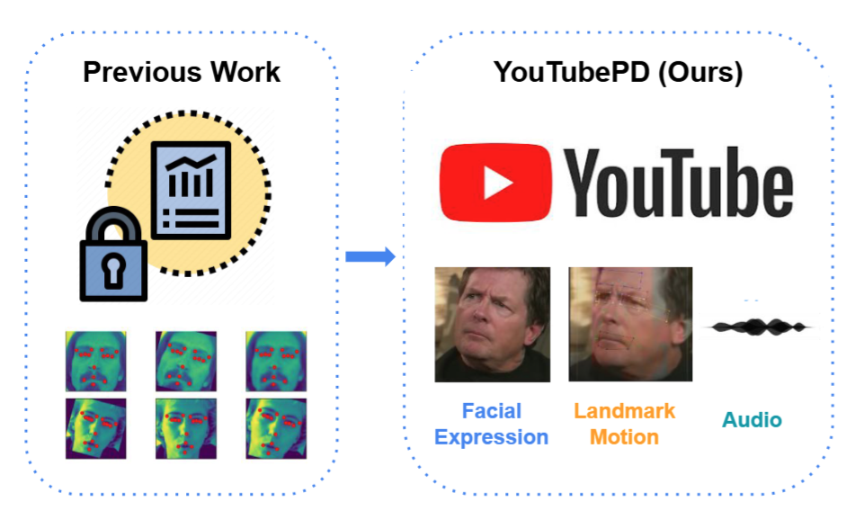

# YouTubePD
## The official implementation for YouTubePD: A Multimodal Benchmark for Parkinson’s Disease Analysis
[[project page]](https://uiuc-yuxiong-lab.github.io/YouTubePD/), [[paper pdf]](https://openreview.net/pdf?id=AIeeXKsspI)

## Data application
Please apply for YouTubePD data access through the form in our [[project page]](https://uiuc-yuxiong-lab.github.io/YouTubePD/). You need to sign an ackonwledgement to have the access.

## Contents
 - [Youtube PD data preprocessing](#YouTubePD-data): This is not required if you download our shared data.
 - [YouTubePD-facial-expression-model](#YouTubePD-facial-expression-model): The video classification task.
 - [YoutubePD-multimodal-synthesis](#YoutubePD-multimodal-synthesis): 
   - multimodal: The multimodal task
   - synthesis: The image progression task
 - [YoutubePD-audio-landmark](#YoutubePD-audio-landmark): Optional code for improved audio and landmark classification.

## Installation
Please follow the requirement of each task to install the environment.

